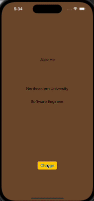

# codepath-ios-prework

Codepath prework project

# Prework - _Prework App_

Submitted by: **Jiajie He**

**Prework App** is an app that allows users to see my info and click the change button to change background color

Time spent: **3** hours spent in total

## Required Features

The following **required** functionality is completed:

- [x] Users are see a screen with three labels and a button
- [x] Tapping the button changes the screen color to a random color

## Video Walkthrough

## App Brainstorming (Step 4)

1. **Youtube**

   - Able to watch video synchronously with others
   - Able to Search videos with images

2. **Apple Music**

   - Music video karaoke
   - Able to adjust bass, vocal, etc

3. **Instagram**
   - Able to change text color
   - Able rearrange posts

**App Idea**
An app that combines the convenience of e-commerce with a focus on borrowing and lending tools and equipment. Similar to Amazon, users can browse a wide variety of tools and equipment, borrow them for a specified period, and return them hassle-free. The app includes a seamless shipping service, making it easy for users to receive and return items at their doorstep. Whether you need a power drill for a weekend project or want to lend out your camping gear, the app provides a reliable platform for the sharing economy of tools.

## License

    Copyright [2024] [Jiajie He]

    Licensed under the Apache License, Version 2.0 (the "License");
    you may not use this file except in compliance with the License.
    You may obtain a copy of the License at

        http://www.apache.org/licenses/LICENSE-2.0

    Unless required by applicable law or agreed to in writing, software
    distributed under the License is distributed on an "AS IS" BASIS,
    WITHOUT WARRANTIES OR CONDITIONS OF ANY KIND, either express or implied.
    See the License for the specific language governing permissions and
    limitations under the License.
